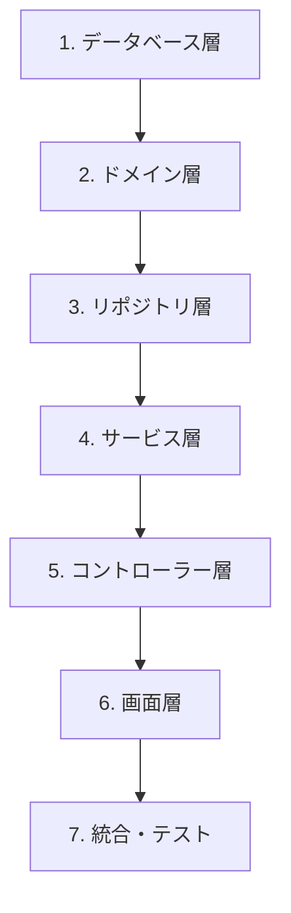

# AIエージェントへの依頼例

このドキュメントでは、GitHub Copilot コーディングエージェントに対する効果的な依頼方法を説明します。
**初めての方は「簡単依頼テンプレート」から始めることをお勧めします。**

## 🚀 簡単依頼テンプレート（初心者向け）

### 📋 基本の3ステップ依頼

複雑な説明は不要！以下のテンプレートをコピーして、**太字部分だけ書き換える**だけで依頼できます。

#### Step 1: Issue作成依頼（最もシンプル）

```
**機能名**の**レイヤー名**を実装するIssueを作成してください。

仕様: specs/**ファイルパス**
```

**例:**
```
メンバー一覧のAPIを実装するIssueを作成してください。

仕様: specs/api/members/list.md
```

#### Step 2: コード実装依頼

```
Issue #**番号** を実装してください。

期待する結果: **どうなってほしいか**
```

**例:**
```
Issue #42 を実装してください。

期待する結果: メンバー一覧APIが正常に動作する
```

#### Step 3: レビューと修正依頼

```
以下を修正してください：
**修正したい内容**
```

**例:**
```
以下を修正してください：
バリデーションエラー時のメッセージが分かりにくい
```

### 🎯 レイヤー別ワンライン依頼

各レイヤーごとの超シンプル依頼テンプレート：

| **レイヤー** | **簡単依頼テンプレート** |
|----------|-------------------------|
| **DB** | `**テーブル名**テーブルを作成してください` |
| **Domain** | `**エンティティ名**エンティティを実装してください` |
| **Repository** | `**エンティティ名**Repositoryを実装してください` |
| **Service** | `**機能名**Serviceを実装してください` |
| **API** | `**機能名**APIを実装してください` |
| **UI** | `**画面名**画面を実装してください` |

**使用例:**
```
Memberテーブルを作成してください
Memberエンティティを実装してください  
MemberRepositoryを実装してください
メンバー一覧Serviceを実装してください
メンバー一覧APIを実装してください
メンバー一覧画面を実装してください
```

#### 📊 DB設計関連の依頼例

```
# DDL生成
specs/db/database-design.md に基づいて、membersテーブルのCREATE TABLE文を生成してください

# マイグレーション作成  
membersテーブル用のFlywayマイグレーションファイル（V1__create_members_table.sql）を作成してください

# サンプルデータ生成
membersテーブル用のサンプルデータINSERT文を10件生成してください。多様な職種・地域を含めてください
```

#### 🏗️ レイヤー別詳細依頼例

**Database層:**
```
specs/db/database-design.md に基づいて、membersテーブルのCREATE TABLE文を生成してください
```

**Domain層:**
```
specs/db/database-design.md のmembersテーブル設計に基づいて、MemberエンティティクラスをJPAアノテーション付きで作成してください
```

**Repository層:**
```
MemberエンティティのJPARepositoryインターフェースを作成してください。基本的なCRUD操作とカスタムクエリメソッドを含めてください
```

**Service層:**
```
specs/api/members/list.md に基づいて、MemberServiceクラスを実装してください。メンバー一覧取得とページング機能を含めてください
```

**API層:**
```
specs/api/members/list.md に基づいて、メンバー一覧取得のRESTエンドポイントを実装してください。MemberControllerクラスを作成してください
```

**UI層:**
```
specs/ui/member-list.md に基づいて、メンバー一覧画面のThymeleafテンプレートを作成してください。検索機能とページング機能も含めてください
```

### 🔧 困ったときの魔法の依頼

以下をそのまま使えば、大抵の問題は解決します：

#### エラーが出たとき
```
以下のエラーを修正してください：
[エラーメッセージをここに貼り付け]
```

#### 何から始めればいいか分からないとき
```
specs/SPEC.md を見て、最初に実装すべきIssueを教えてください
```

#### コードが動かないとき
```
動かない理由を調べて修正してください。
期待: [期待する動作]
現実: [実際の動作]
```

#### テストを書いてほしいとき
```
[クラス名/メソッド名] のテストを書いてください
```

### 📚 よく使う依頼パターン

コピペですぐ使える頻出パターン：

```bash
# 新機能開発
「**機能名**機能の開発を始めたいです。必要なIssueを全て作成してください」

# バグ修正  
「**症状**のバグを修正してください」

# ドキュメント更新
「README.mdを最新の状態に更新してください」

# テスト追加
「**機能名**のテストを追加してください」

# コードレビュー
「**ファイル名**をレビューして改善点を教えてください」

# 環境構築
「開発環境をセットアップしてください」
```

---

## 📖 詳細ガイド（上級者向け）

より詳細な制御が必要な場合は、以下の詳細ガイドを参照してください。

## Issue作成の基本原則

### 粒度の基準

**適切な粒度**: 1つのIssueは **1つの責務・レイヤー** に集中する

#### ✅ 推奨する粒度（細分化）

```
❌ 悪い例: 「メンバー管理機能を実装してください」
✅ 良い例: 
- 「メンバー一覧APIのエンドポイントを実装してください」
- 「メンバー一覧画面のUI実装をしてください」  
- 「メンバー詳細APIと画面の連携処理を実装してください」
```

#### レイヤー別Issue分割例

| レイヤー | Issue例 | 含む内容 |
|----------|---------|----------|
| **データベース層** | `[DB] メンバーテーブルの作成` | DDL、インデックス、制約 |
| **ドメイン層** | `[Domain] Memberエンティティの実装` | エンティティ、バリデーション |
| **リポジトリ層** | `[Repository] MemberRepositoryの実装` | データアクセス処理 |
| **サービス層** | `[Service] MemberServiceの実装` | ビジネスロジック |
| **コントローラー層** | `[API] メンバー一覧APIの実装` | エンドポイント、リクエスト処理 |
| **画面層** | `[UI] メンバー一覧画面の実装` | HTML、CSS、JavaScript |
| **統合層** | `[Integration] 一覧APIと画面の連携` | フロント・バック連携 |

## 開発順序のルール

### 基本フロー: ボトムアップ開発



### 詳細な開発順序

#### フェーズ1: 基盤構築
1. **データベース設計** → DDL作成
2. **ドメインモデル** → エンティティ定義
3. **リポジトリ** → データアクセス層

#### フェーズ2: ビジネスロジック
4. **サービス層** → ビジネスルール実装
5. **API層** → RESTエンドポイント

#### フェーズ3: UI構築
6. **画面設計** → HTML/CSS実装
7. **画面ロジック** → JavaScript実装

#### フェーズ4: 統合
8. **API-UI連携** → フロント・バック統合
9. **統合テスト** → E2Eテスト

### 例外ケース: トップダウン開発

以下の場合はトップダウン（画面→API）も可：

- **プロトタイプ開発**: UI確認を優先したい場合
- **モックAPI**: フロント開発を先行したい場合
- **設計検証**: ユーザビリティ確認が必要な場合

## 効果的な依頼例

### 1. Issue作成依頼

#### データベース層
```
「メンバーテーブルのDDLを作成するIssueを立ててください。

要件:
- specs/ui/member-list.md の項目に基づく
- id（主キー）、name、email（ユニーク）、phone、created_at、updated_at
- PostgreSQL対応
- インデックスとバリデーション制約も含める」
```

#### API層
```
「specs/api/members/list.md に基づいて、メンバー一覧APIの実装Issueを作成してください。

前提:
- MemberService が既に実装済み
- データベースとドメイン層は完成

実装範囲:
- GET /api/members エンドポイント
- ページング・検索パラメータ対応
- レスポンスのJSON設計
- 単体テスト含む」
```

#### UI層
```
「specs/ui/member-list.md の画面実装Issueを立ててください。

実装内容:
- Thymeleafテンプレート
- 検索フォーム（名前・メール検索）
- ページング機能
- CSSスタイリング（Bootstrap使用）
- JavaScript（検索・ページング制御）

注意:
- APIとの連携は別Issueで実装予定」
```

### 2. 実装依頼

#### 具体的で明確な指示
```
「以下の仕様でMemberServiceクラスを実装してください：

参照仕様: specs/api/members/list.md

実装内容:
1. findAllMembers() メソッド
2. findMembersByName(String name) メソッド
3. findMembersByEmail(String email) メソッド
4. ページング対応（Pageable使用）
5. 例外ハンドリング（MemberNotFoundException）

技術制約:
- Spring Boot 3.5.x
- JPA使用
- トランザクション管理
- ログ出力（INFO、ERROR）」
```

### 3. コードレビュー観点の指示

```
「以下の観点でコードレビューをお願いします：

1. アーキテクチャ準拠: docs/architecture.md
2. コーディング規約: docs/conventions.md  
3. セキュリティ: docs/policies.md
4. テストカバレッジ: 80%以上
5. パフォーマンス: N+1クエリ対策」
```

## トラブルシューティング依頼

### エラー解決
```
「以下のエラーを解決してください：

エラー内容: [具体的なエラーメッセージ]
発生タイミング: [操作手順]
期待動作: [本来の動作]
環境: Java 25, Spring Boot 3.5.x, PostgreSQL

調査依頼:
1. ログ分析
2. 原因特定  
3. 修正案の提案
4. 再発防止策」
```

### パフォーマンス改善
```
「メンバー一覧表示が遅い問題を改善してください：

現状: 1000件表示に3秒
目標: 1秒以内

調査観点:
- SQLクエリ分析
- N+1問題チェック
- インデックス最適化
- ページネーション検討」
```

## 依頼時の注意点

### ✅ 良い依頼の特徴

1. **具体的な仕様参照**: specs/内のファイルを必ず指定
2. **前提条件明記**: 依存関係や実装済み機能
3. **成功条件定義**: 完了の判断基準
4. **技術制約明示**: 使用技術・フレームワーク
5. **テスト要求**: 単体・統合テストの範囲

### ❌ 避けるべき依頼

1. **曖昧な指示**: 「良い感じに実装して」
2. **範囲過大**: 複数レイヤーを一度に依頼
3. **仕様不足**: 詳細な要件なしの依頼
4. **技術指定なし**: フレームワーク・ライブラリ未指定

## Issue管理のベストプラクティス

### ラベル活用

```
[DB] - データベース関連
[Domain] - ドメインモデル
[Repository] - データアクセス
[Service] - ビジネスロジック
[API] - RESTエンドポイント
[UI] - フロントエンド
[Integration] - システム連携
[Test] - テスト実装
[Doc] - ドキュメント更新
```

### 依存関係の明記

```markdown
## 依存Issue
- #123: Memberエンティティの実装 ← 完了必須
- #124: MemberRepositoryの実装 ← 完了必須

## 後続Issue  
- #126: メンバー登録画面実装 ← 本Issueの完了後
```

### 完了条件（Definition of Done）

```markdown
## 完了条件
- [ ] 仕様通りの機能実装
- [ ] 単体テスト実装（カバレッジ80%以上）
- [ ] コードレビュー完了
- [ ] ドキュメント更新
- [ ] 統合テスト通過
```

この粒度とルールに従うことで、AIエージェントとの協働開発がより効率的で品質の高いものになります。

---

## 🆘 よくある質問（FAQ）

### Q1: 何から始めればいいか分からない
**A:** まずこれを試してください：
```
「SPEC.mdを見て、最初に実装すべき機能を教えてください」
```

### Q2: エラーが出て困っている
**A:** エラーメッセージをそのまま貼り付けてください：
```
「以下のエラーを修正してください：
[エラーメッセージ全文をここに貼り付け]」
```

### Q3: 1つの機能を一気に作りたい
**A:** 一気に作らず、段階的に進めてください：
```
「メンバー一覧機能の実装計画を立てて、Issue一覧を作成してください」
```

### Q4: コードが期待通りに動かない
**A:** 期待と現実を明確に書いてください：
```
「期待: メンバー一覧画面で検索結果が表示される
現実: 検索しても何も表示されない
原因を調査して修正してください」
```

### Q5: テストの書き方が分からない
**A:** クラス名を指定するだけでOK：
```
「MemberServiceクラスのテストを書いてください」
```

### Q6: どのレイヤーから実装すべきか分からない
**A:** 迷ったらこの順番で：
```
1. データベース → 2. エンティティ → 3. Repository → 4. Service → 5. API → 6. 画面
```

### Q7: AIの提案が理解できない
**A:** 遠慮なく説明を求めてください：
```
「提案内容を初心者にも分かるように詳しく説明してください」
```

### Q8: 複数の選択肢で迷っている
**A:** 判断基準を含めて相談してください：
```
「AパターンとBパターンがあります。パフォーマンス重視の場合、どちらがおすすめですか？理由も教えてください」
```

## 📋 チートシート（コピペ用）

### 🎯 超頻出依頼（そのまま使える）

```bash
# 開発開始
「[機能名]機能の開発を始めます。必要なIssue一覧を作成してください」

# Issue実装  
「Issue #[番号] を実装してください」

# エラー修正
「以下のエラーを修正してください：[エラーメッセージ]」

# テスト追加
「[クラス名] のテストを書いてください」

# コードレビュー
「[ファイル名] をレビューして改善点を教えてください」

# 説明要求
「[処理/コード] について初心者向けに説明してください」

# 最適化
「[機能名] のパフォーマンスを改善してください」

# ドキュメント更新
「README.mdを最新状態に更新してください」
```

### 🏷️ レイヤー別テンプレート

| 目的 | テンプレート |
|------|-------------|
| **DB作成** | `[テーブル名]テーブルを作成してください` |
| **エンティティ** | `[エンティティ名]エンティティを実装してください` |
| **Repository** | `[エンティティ名]Repositoryを実装してください` |
| **Service** | `[機能名]Serviceを実装してください` |
| **API** | `[機能名]APIを実装してください` |
| **画面** | `[画面名]を実装してください` |
| **連携** | `[API名]と[画面名]を連携してください` |

### 🛠️ トラブルシューティング用

```bash
# 動かない
「動かない理由を調べて修正してください」

# 遅い
「[機能名]が遅いです。高速化してください」

# 分からない
「[技術用語/概念]について教えてください」

# 選択に迷う
「[A]と[B]のメリット・デメリットを比較してください」

# 品質向上
「コードの品質を向上させてください」

# セキュリティ
「セキュリティの問題がないかチェックしてください」
```

### 💡 効果的な依頼のコツ

✅ **良い依頼の特徴:**
- 具体的（「良い感じに」ではなく「エラー時に赤字で表示」）
- 1つの目的に集中（複数の要求を1つにまとめない）
- 期待結果を明記（「どうなってほしいか」を書く）

❌ **避けるべき依頼:**
- 曖昧（「適当に」「良い感じに」）
- 範囲が広すぎる（「全部作って」）
- 情報不足（仕様やファイルを指定しない）

---

## 🎉 依頼成功のための最終チェック

依頼前に以下を確認してください：

- [ ] **何を**したいかが明確
- [ ] **どうなってほしいか**が具体的  
- [ ] 関連する**仕様書**を指定
- [ ] 1つの**小さな単位**に絞られている

この4点を満たせば、AIエージェントとの協働開発がスムーズに進みます！
