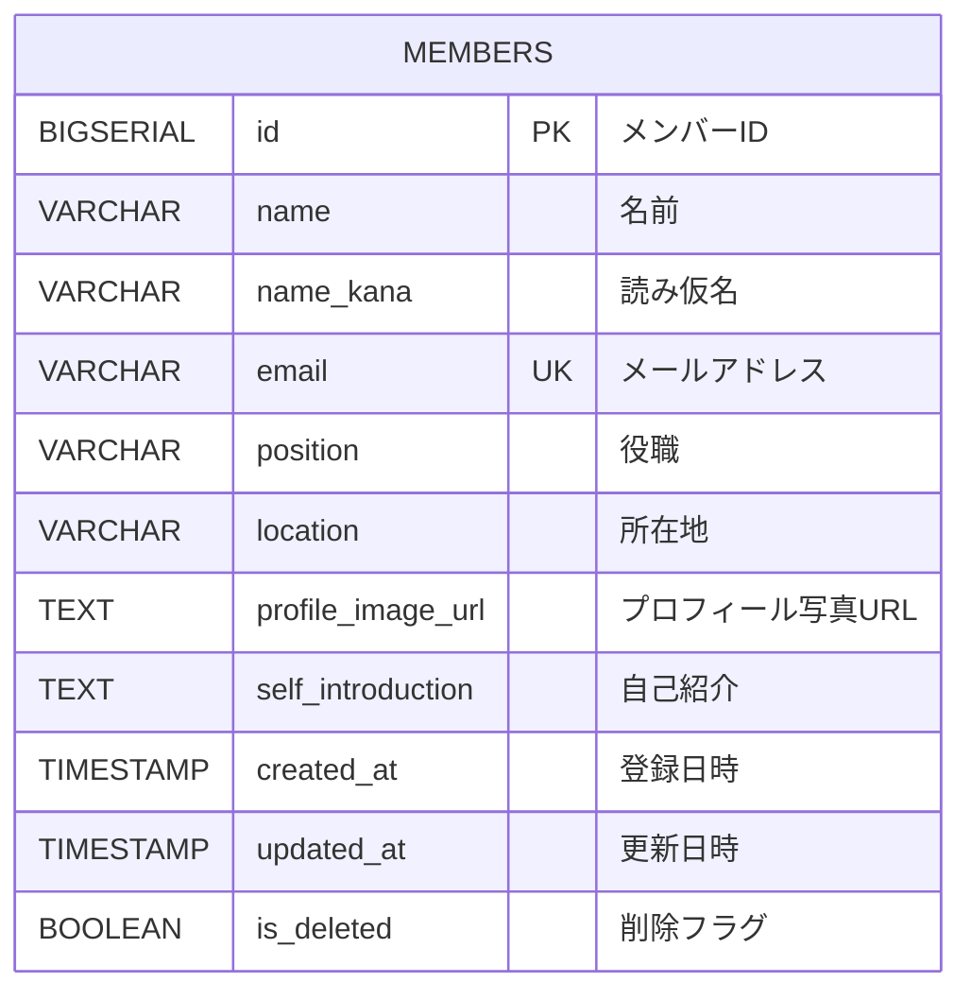

# データベース設計書

## 概要
メンバー一覧アプリケーションのデータベース設計です。メンバー情報の永続化を担います。

## 要件
- メンバー情報の CRUD 操作
- メールアドレスの一意性保証
- 論理削除による安全な削除機能
- 検索・ページング性能の最適化

## 基本仕様
- **DBMS**: PostgreSQL 15+
- **命名規則**: スネークケース
- **文字コード**: UTF-8
- **タイムゾーン**: Asia/Tokyo

## ER図


## membersテーブル

| カラム名 | データ型 | 制約 | 説明 |
|---------|---------|------|------|
| id | BIGSERIAL | PRIMARY KEY | メンバーID |
| name | VARCHAR(100) | NOT NULL | 名前 |
| name_kana | VARCHAR(100) | NOT NULL | 読み仮名（ひらがな） |
| email | VARCHAR(255) | NOT NULL, UNIQUE | メールアドレス |
| position | VARCHAR(100) | - | 役職 |
| location | VARCHAR(200) | - | 所在地 |
| profile_image_url | TEXT | - | プロフィール写真URL |
| self_introduction | TEXT | - | 自己紹介 |
| created_at | TIMESTAMP | NOT NULL, DEFAULT CURRENT_TIMESTAMP | 登録日時 |
| updated_at | TIMESTAMP | NOT NULL, DEFAULT CURRENT_TIMESTAMP | 更新日時 |
| is_deleted | BOOLEAN | NOT NULL, DEFAULT FALSE | 削除フラグ |

## インデックス
- `email` (UNIQUE, WHERE is_deleted = FALSE)
- `is_deleted, created_at DESC` (一覧表示用)
- `name` (検索用, WHERE is_deleted = FALSE)
- `name_kana` (読み仮名検索用, WHERE is_deleted = FALSE)

## 制約・ルール
- メールアドレスは論理削除時のみ重複可能
- 名前・読み仮名・メールアドレスは必須
- 読み仮名はひらがなのみ
- 論理削除により履歴保持

## Copilot依頼例

```
# DDL生成
この設計書に基づいてmembersテーブルのCREATE TABLE文を作成してください

# マイグレーション作成  
membersテーブル用のFlywayマイグレーション（V1__create_members_table.sql）を作成してください

# サンプルデータ生成
membersテーブル用のサンプルデータを10件生成してください
```